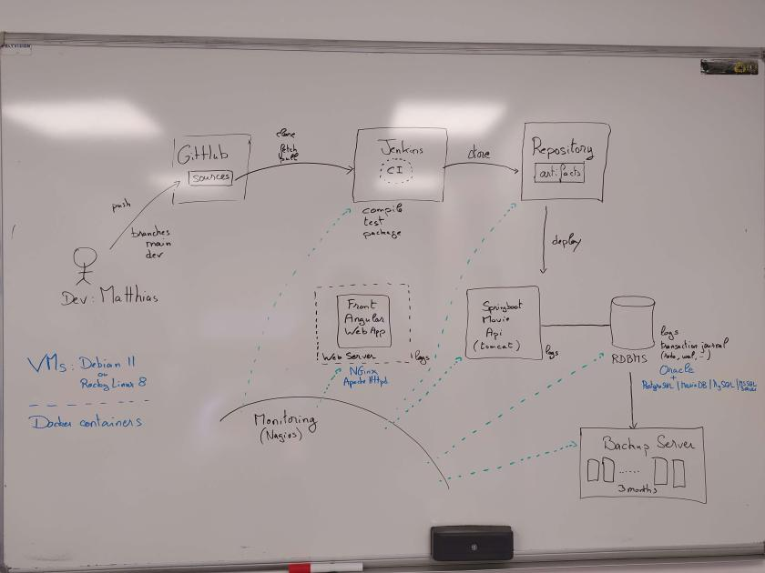

# Projet final POE Ingénieur de Production

Mise en place et supervision d'une plateforme CI-CD en production.
La plateforme sera soit basée sur des machines virtuelles soit des conteneurs Docker.

Une première plateforme sera mise en place avec une base de données 
Oracle Database Entreprise (19c ou 21c).

Une 2ème plateforme pourra être mise en place avec une base de données alternative:
MariaDB ou PostgreSQL ou Microsoft SQL Server ou Mysql Community

## Partie 1: Infrastructure
Mettre en place la plateforme de la figure générale jointe.

## Partie 2: CI-CD
Intégrer et déployer l'application 3 tiers:
- Front Angular sur une serveur web Nginx ou Apache Httpd
- Back Java Springboot
- Base de données relationnelles

## Partie 3: Supervision
Superviser les services, logs, espaces disques et backups

## Partie 4: Restauration après crash
Restaurer l'applicatif avec le minimum de perte de données après crash complet de l'applicatif (attaque, incendie, ...).